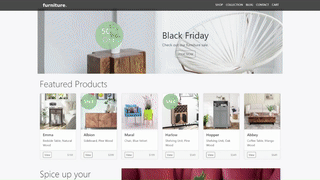

# [FSI Image](https://www.neptunelabs.com) &middot; Samples
| ***Pixel-perfect*** | ***High-DPI-ready*** | ***Fast :rocket:*** | ***Hackable*** | ***Consistent*** |
|:-----------------:|:-------------:|:---------------:|:---------------:|:---------------:|

[](https://github.com/neptunelabs/fsi-image-samples/blob/main/LICENSE)

Dynamic Single Source Imaging with FSI Server lets you change your images at any size, at any time - simply by changing the URL.
All you need is a high-resolution image - FSI Server creates the desired image sizes, cropping and effects in an instant.
Dynamic Single Source Imaging can be applied to any image on the site.

This repository contains examples on how to use and build your own applications.



## Getting Started

Without starting this project in your IDE, you can discover, develop and customize
all demos in JSFiddle.

[Website Frontpage in JSFiddle][frontjsf]

[Product Listing Page in JSFiddle][plpjsf]

[Product Detail Page in JSFiddle][pdpjsf]

[Product Configurator in JSFiddle][confjsf]

[frontjsf]: https://jsfiddle.net/gh/get/library/pure/neptunelabs/fsi-jsfiddle-samples/tree/master/fsi-image-samples/frontpage
[plpjsf]: https://jsfiddle.net/gh/get/library/pure/neptunelabs/fsi-jsfiddle-samples/tree/master/fsi-image-samples/plp
[pdpjsf]: https://jsfiddle.net/gh/get/library/pure/neptunelabs/fsi-jsfiddle-samples/tree/master/fsi-image-samples/pdp
[confjsf]: https://jsfiddle.net/gh/get/library/pure/neptunelabs/fsi-jsfiddle-samples/tree/master/fsi-image-samples/configurator

## Start and develop

To run and modify this samples:

#### NPM

```shell
npm install
npm install
```
or

#### Yarn

```shell
yarn
yarn start
```

Now you can customize the demo according to your own preferences or develop something new.

You can find a very simple example to start with in the ``samples/starter`` folder.

## How it works

These examples rely on a framework that uses [Grunt][Grunt], [Browsersync][Browsersync],
[Bootstrap][Bootstrap] and Sass to launch a local server,
replace template variables and pass changes directly to the browser window.

However, these dependencies are generally **not required** for the use of FSI Layers!

## Requirements

To run the demo you do not need your own image server.
If you don't have your own server but still want to use your own images,
you can use an [evaluation copy][Server] indefinitely.
In case of an own server, please copy ``env.yml.dist`` to ``env.yml`` and
change the settings.


## Documentation

The official FSI Viewer and FSI Server documentation can be found here: [https://docs.neptunelabs.com/fsi-viewer/][Docs]

[Docs]: https://docs.neptunelabs.com/fsi-viewer/
[Server]: https://www.neptunelabs.com/get/
[Grunt]: https://gruntjs.com/
[Browsersync]: https://browsersync.io/
[Bootstrap]: https://getbootstrap.com/
