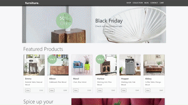

# Auto-generated Responsive Image Samples

| ***Pixel-perfect*** | ***High-DPI-ready*** | ***Fast :rocket:*** | ***Hackable*** | ***Consistent*** |
|:-------------------:|:--------------------:|:-------------------:|:--------------:|:----------------:|

[][License]

---

* [Live Samples @ GitHub Pages 🔗][GHPages]
* [Auto-generated Responsive Images - Product Page 🔗](https://www.neptunelabs.com/dynamic-imaging/)
* [Documentation 🔗][Docs]

Dynamic Single Source Imaging with FSI Server lets you change your images at any size, at any time - simply by changing
the URL. All you need is a high-resolution image - FSI Server creates the desired image sizes, cropping and effects in
an instant. Dynamic Single Source Imaging can be applied to any image on the site.

This repository contains examples on how to use and build your own applications.



## Getting Started

Without starting this project in your IDE, you can discover all the
demos on the [GitHub Pages][GHPages] or develop and customise in [StackBlitz][Stackblitz].

## Start and develop

To run and modify this samples:

#### NPM

```shell
npm install
npm install
```

or

#### Yarn

```shell
yarn
yarn start
```

Now you can customize the demo according to your own preferences or develop something new.

You can find a very simple example to start with in the ``samples/starter`` folder.

## How it works

These examples rely on a framework that uses [Grunt][Grunt], [Browsersync][Browsersync],
[Bootstrap][Bootstrap] and Sass to launch a local server,
replace template variables and pass changes directly to the browser window.

However, these dependencies are generally **not required** for the using images with FSI
Server!

## Requirements with own images

The images are loaded from an image server (FSI server) in dynamic resolution.
In addition, depending on the sample, static assets such as JavaScript, CSS or static images may also be required.
In this demo, images and static assets are loaded from an example server.
For your **own images** with these examples in this repository,
a separate image server instance is required.

To do this quickly, you can use an [evaluation copy][Server] for an unlimited period
of time.

The recommended way to quickly start your own instance via Docker is described
in this [repository][FSIDockerRepo].

If you have your own server, copy ``env.yml.dist`` to ``env.yml`` and change the settings
according to your FSI server URL.


## Documentation

For further information on the FSI Viewer and FSI Server,
please refer to the official [documentation][Docs].

[License]: https://github.com/neptunelabs/fsi-image-samples/blob/main/LICENSE

[Docs]: https://docs.neptunelabs.com/

[Server]: https://www.neptunelabs.com/get/

[FSIDockerRepo]: https://github.com/neptunelabs/fsi-server-docker-v22

[Grunt]: https://gruntjs.com/

[Browsersync]: https://browsersync.io/

[Bootstrap]: https://getbootstrap.com/

[GHPages]: https://neptunelabs.github.io/fsi-image-samples/

[Stackblitz]: https://stackblitz.com/edit/fsi-image-samples
