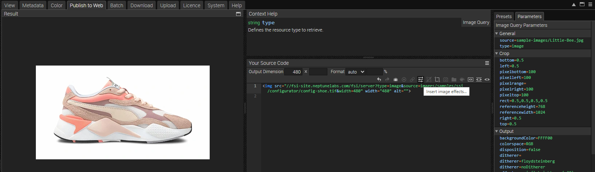
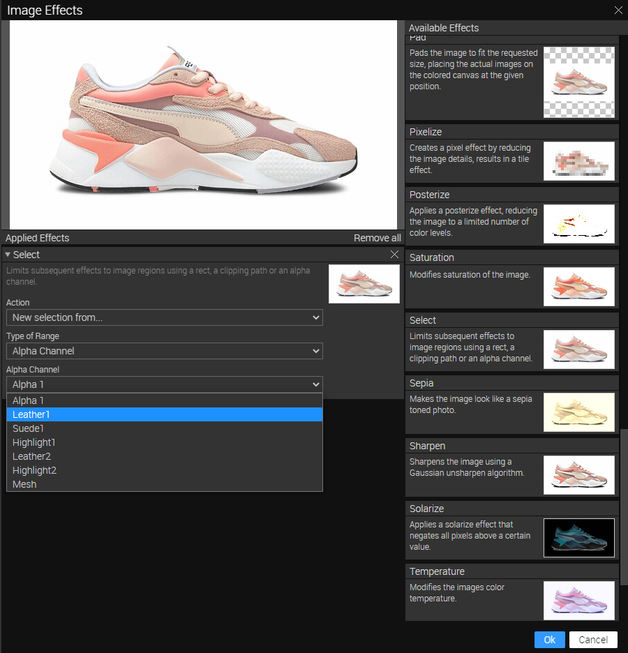
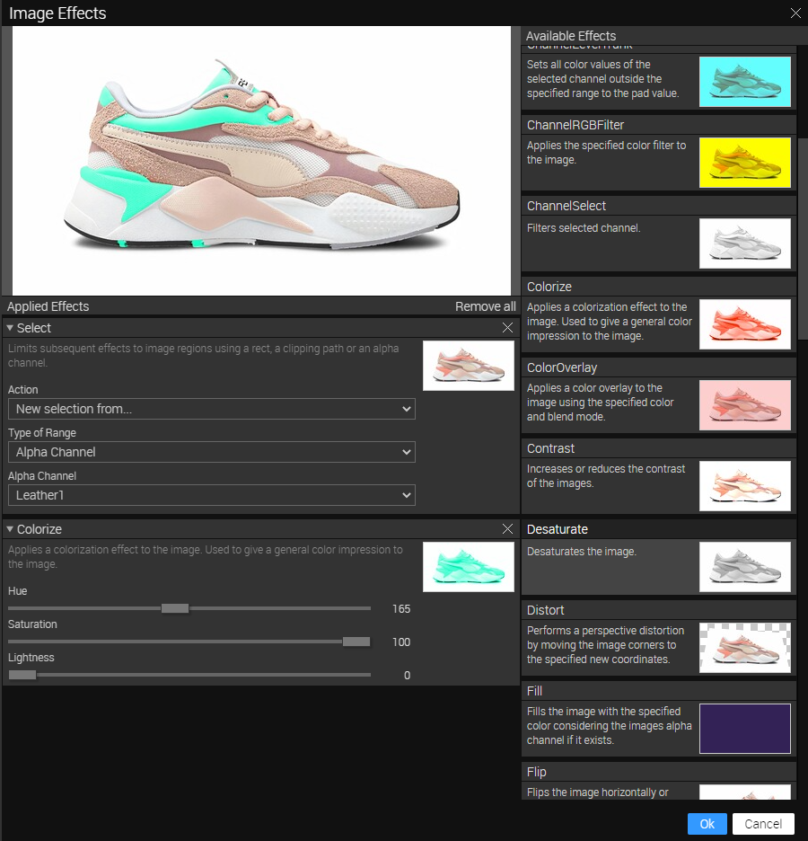

# Configurator - Images with Alpha Channels
This readme describes how the configurator example is achieved using *Single Source Imaging* from *FSI Server*.
The aim of the demo is to show how alpha channels can be addressed by simply changing the image URL and using image effects.

# Adding Alpha Channels to your image

First, it's important to set up the Alpha Channels for your image. This can be achieved by using a
photo editing software like Photoshop.

A quick description how to do this in Photoshop:

- open your image
- with the Selection Tool, select the area you want to have as an Alpha Channel
- click on the tab *Channels*
- Use the *Save Selection As Channel* button
- Name your channel accordingly
- Add as many channels as you need
- save your image as *.tif
- upload image to your FSI Server

# Building the configurator

For this example, we have used Bootstrap to create a sample website framework.

All images and colour selectors are built using JS.

The image is embedded like this:

```html
   
   ```
And the colour selectors are implemented as follows:

```html
 <div class='pb-1' id='colorSelector'></div>
   ```

In `config.js' we then build the configurator.

First we set an EventListener as soon as the DOM is loaded:

```javascript
document.addEventListener('DOMContentLoaded', () => {
  generateSelector()
  document.getElementById('image').src = getColorizeImage(clipColors)
})
```
We set an image base path and define colour sets to add different colours and sections to the image.
```javascript
const baseImgPath = '{{&fsi.server}}/{{&fsi.context}}/server?type=image&source=images/samples/ssi/configurator/'
const imgWidth = 660
const clipColors = []


const productData = {
name: 'config-shoe.tif', colors: {
cream: {name: 'Cream', rgb: '251,217,193', hsb: '26,90,55'},
coffee: {name: 'Coffee', rgb: '150,115,106', hsb: '11,17,0'},
salmon: {name: 'Salmon', rgb: '227,134,126', hsb: '4,66,10'},
orange: {name: 'Orange', rgb: '253,106,75', hsb: '10,100,0'},
berry: {name: 'Berry', rgb: '252,118,159', hsb: '342,98,17'},
mauve: {name: 'Mauve', rgb: '185,202,249', hsb: '227,90,55'},
purple: {name: 'Purple', rgb: '143,146,243', hsb: '238,83,0'},
blue: {name: 'Blue', rgb: '63,173,252', hsb: '205,100,0'},
fresh: {name: 'Fresh', rgb: '96,233,203', hsb: '167,83,0'},
lime: {name: 'Lime', rgb: '110,245,92', hsb: '114,83,0'},
sun: {name: 'Sun', rgb: '248,233,115', hsb: '55,68,13'},
},
colorSets: [{
desc: 'Back',
clippingPath: 1,
selected: 'blue',
colors: ['cream', 'coffee', 'salmon', 'orange', 'berry', 'mauve', 'purple', 'blue', 'fresh', 'lime', 'sun'],
}, {
desc: 'Suede', clippingPath: 2, selected: 'blue', colors: ['coffee', 'salmon', 'berry', 'mauve', 'blue', 'sun'],
}, {
desc: 'Finish',
clippingPath: 3,
selected: 'orange',
colors: ['coffee', 'salmon', 'orange', 'berry', 'mauve', 'blue', 'fresh', 'lime'],
}, {
desc: ' Velvet',
clippingPath: 4,
selected: 'blue',
colors: ['cream', 'coffee', 'salmon', 'berry', 'mauve', 'blue', 'fresh', 'sun'],
}, {
desc: ' Side',
clippingPath: 5,
selected: 'orange',
colors: ['cream', 'coffee', 'salmon', 'orange', 'berry', 'mauve', 'purple', 'blue', 'fresh', 'lime', 'sun'],
},]
}
```

The image is built by adding the image base, the effect itself (select(New,Alpha,1),colorize(colour)) and the associated values retrieved from the colour selector.
The current image is then replaced with the newly created image.

```javascript
const getEffectImage = (clipEffects, width) => {
return baseImgPath + productData.name + '&width=' + width + '&effects=' + clipEffects.join(',')
}
```

# Defining the colour values

You can use the FSI Server Interface to determine the colour values you need:
Select the image with the alpha channels, go to the Publish tab and select *Simple Image* from the templates on the right.
on the right.



In the *Your Source* section, select the Image Effects icon (see above).

In the modal, go to the *Select* effect and add it by dragging and dropping it to the left.
Select *Alpha Channel* as the type of area and choose the alpha channel you want to use:



Now add the Colorize effect to your list of effects.
By changing the hue, saturation and lightness, you can instantly see the changes in the
preview window:



You can add as many selections/colours as you like.
The only thing you need to keep in mind is the correct order:
First add the alpha channel via Select, then add the colourisation.

At the end, your image URL might look like this:

[https://docs.neptunelabs.com/fsi/server?type=image&source=images/samples/ssi/configurator/config-shoe.tif&width=940&effects=select(New,Alpha,1),colorize(4,66,10),select(New,Alpha,2),colorize(0,24,0),select(New,Alpha,3),colorize(10,50,0),select(New,Alpha,4),colorize(11,17,0),select(New,Alpha,5),colorize(10,24,0)](https://docs.neptunelabs.com/fsi/server?type=image&source=images/samples/ssi/configurator/config-shoe.tif&width=940&effects=select(New,Alpha,1),colorize(4,66,10),select(New,Alpha,2),colorize(0,24,0),select(New,Alpha,3),colorize(10,50,0),select(New,Alpha,4),colorize(11,17,0),select(New,Alpha,5),colorize(10,24,0))


,colorize(4,66,10),select(New,Alpha,2),colorize(0,24,0),select(New,Alpha,3),colorize(10,50,0),select(New,Alpha,4),colorize(11,17,0),select(New,Alpha,5),colorize(10,24,0))


## Testing with examples from  your own server

To test the examples with images from your own [FSI Server](https://www.neptunelabs.com/fsi-server/), please first copy the env.yml.dist file to env.yml and adapt the file, then restart the main demo again.
