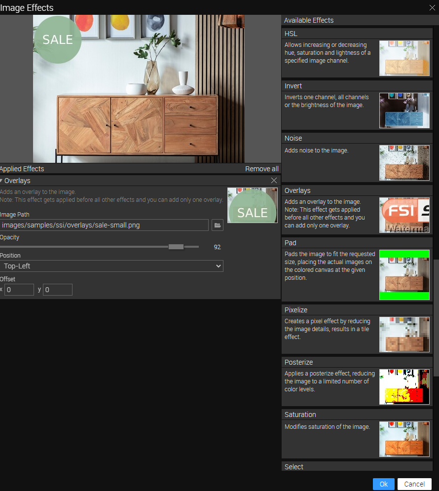

# Frontpage - Embedding images using Single Source Imaging

This readme describes how the front page sample with *Single Source Imaging* of *FSI Server* is achieved.
The aim of the demo is to show how you can easily integrate different sizes and formats of an image by simply changing the Image URL.
It also shows how static assets saved on FSI Server can be embedded.

# Add your images/ assets to FSI Server

First, you'll need to upload the images you want to use to FSI Server.
You can install a [demo version](https://www.neptunelabs.com/get/) via Docker or use our [online demo server](https://demo.fsi-server.com/fsi/interface/) to try it out first.

It's important to use the correct source connector for your images:

- *Storage*: images will be imported to the storage for high performance Single Source Imaging
- *Static*: for static files only, e.g. style graphics you want to use on your website

# Uploading images

Depending on the type of the selected source connector, you can upload different types of files. There are several possibilities to upload images into the interface.


- Choose the Upload tab, click the "Choose files" button to add files to upload to the list. The files will be uploaded to the current folder.
- Drag & Drop files to the file view or the tree view

# Use images on the website

While having an image or folder selected, you can see all possible publishing ways for the specific item by visting the Publish To Web tab.
For this example, select the preset *Simple Image*:


Simple Image publishes the image with a simple  tag. Requires a single high resolution image. You can set the output dimensions and format (auto automatically chooses the best format for the browser used, or you can set WEBP, JPEG, PNG or GIF) as well as add various effects to the static image.


The *Source Code* section enables you to control the look of your image or viewer by setting the dimensions and format, as well as adding effects or crop options to it.
In this area you also can see the source code for your selected publishing option which you can edit and copy to publish the images.

You can then add the images to your site via image tag:

```html
 
```
You can change the width and/or height directly in the image tag, the image will scale accordingly.

# Adding overlays (Sale icon)

It's also possible to add overlays to your images, such as the sales icon which is placed
over some of the images in the *Featured Prodcuts* section.


You can do this easily in the *Publish To Web* tab. While having selected *Simple Image* as preset,
choose the effects icon in the Source Code toolbar.


In the modal, add the *Overlays* effect to the image via drag & drop.
Choose the image path where your overlay is stored on FSI Server. You can then change the opacity, position and offset and
see the changes directly in the preview window.
Select OK as soon as you are finished.



The URL created will look like this:


[https://fsi-site.neptunelabs.com/fsi/server?type=image&source=images/samples/ssi/furniture/nathan-oakley-CYfb0qyQ6WM-unsplash.jpg&width=283&rect=0.18817,0,0.71387,1&renderer=overlay&overlays=images/samples/ssi/overlays/sale-small.png(88,TL,0,0)](https://fsi-site.neptunelabs.com/fsi/server?type=image&source=images/samples/ssi/furniture/nathan-oakley-CYfb0qyQ6WM-unsplash.jpg&width=283&rect=0.18817,0,0.71387,1&renderer=overlay&overlays=images/samples/ssi/overlays/sale-small.png(88,TL,0,0))


# Adding static assets

You can add static assets such as SVG or videos via FSI Server as well.

For this, assets need to be uploaded to a corresponding *static* source connector.
Afterwards, you can see the URL of the asset in the *Metadata* tab.
Just add this URL to your site:

SVG:
```html

```

Video:
```html
<video class="vid-fluid" width="1215" autoplay loop>
  <source src="//fsi-site.neptunelabs.com/fsi/static/assets/samples/ssi/pexels-max-vakhtbovych-7749089.mp4" type="video/mp4">
</video>
```

## Testing with examples from  your own server

To test the examples with images from your own [FSI Server](https://www.neptunelabs.com/fsi-server/), please first copy the env.yml.dist file to env.yml and adapt the file, then restart the main demo again.
