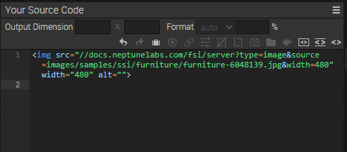
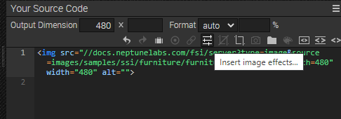

# Frontpage - Embedding images using Single Source Imaging

This readme describes how the front page example is achieved using *Single Source Imaging* from *FSI Server*.
The aim of the demo is to show how you can easily integrate different sizes and formats of an image by simply changing the image URL.
We use Bootstrap for building our page.
The demo also shows how static assets stored on FSI Server can be embedded.

# Use images on the website

When an image or folder is selected, you can see all the possible publishing options for that item by going to the Publish To Web tab.
For this example, select the *Simple Image* preset:


Simple Image publishes the image with a simple  tag. Requires a single high resolution image. You can set the output dimensions and format (Auto automatically selects the best format for the browser used, or you can set WEBP, JPEG, PNG or GIF) and add various effects to the static image.


The Source Code section allows you to control the appearance of your image or viewer by setting the dimensions and format, as well as adding effects or cropping options.
This section also displays the source code for your chosen publishing option, which you can edit and copy to publish the images.

You can then add the images to your site using image tags:

```html
 
```
You can change the width and/or height directly in the image tag and the image will be scaled accordingly.

# Adding overlays (Sale icon)

It's also possible to add overlays to your images, such as the sales icon that appears over some of the
over some images in the Featured Products section.


You can do this easily in the *Publish to Web* tab. With the *Simple Image* preset selected,
select the effects icon in the Source Code toolbar.



In the Modal, drag and drop the *Overlays* effect onto the image.
Select the image path where your overlay is stored on FSI Server. You can then change the opacity, position and offset of the overlay.
changes directly in the Preview Window.
Select OK when you are finished.


The URL created will look like this:


[https://docs.neptunelabs.com/fsi/server?type=image&source=images/samples/ssi/furniture/nathan-oakley-CYfb0qyQ6WM-unsplash.jpg&width=283&rect=0.18817,0,0.71387,1&renderer=overlay&overlays=images/samples/ssi/overlays/sale-small.png(88,TL,0,0)](https://docs.neptunelabs.com/fsi/server?type=image&source=images/samples/ssi/furniture/nathan-oakley-CYfb0qyQ6WM-unsplash.jpg&width=283&rect=0.18817,0,0.71387,1&renderer=overlay&overlays=images/samples/ssi/overlays/sale-small.png(88,TL,0,0))


# Adding static assets

You can also add static assets such as SVG or video via FSI Server. In our example, the furniture SVG logo is uploaded via the
FSI Server.

To do this, assets must be uploaded to an appropriate *static* source connector.
You will then see the asset's URL in the Metadata tab.
Simply add this URL to your website:

SVG:
```html

```

## Testing with examples from  your own server

To test the examples with images from your own [FSI Server](https://www.neptunelabs.com/fsi-server/), please first copy the env.yml.dist file to env.yml and adapt the file, then restart the main demo again.
