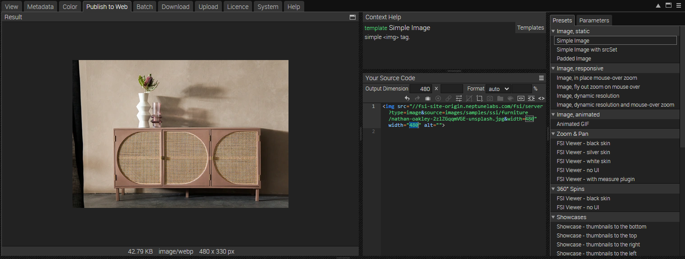
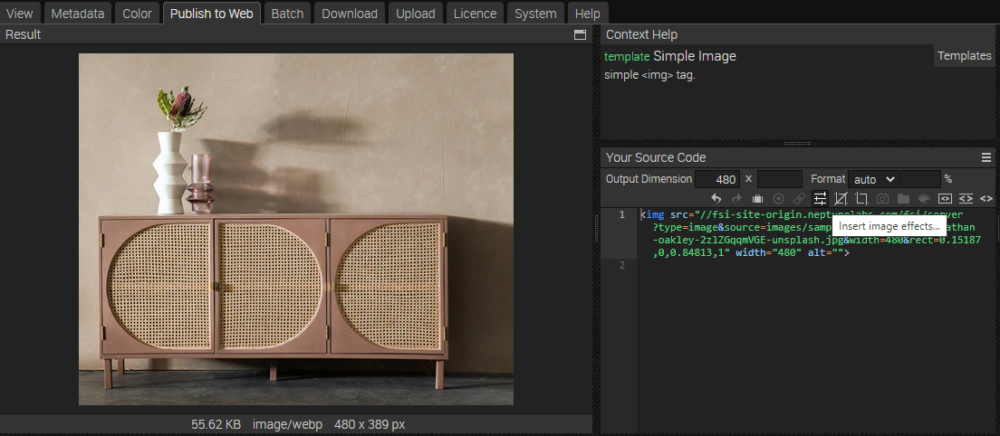
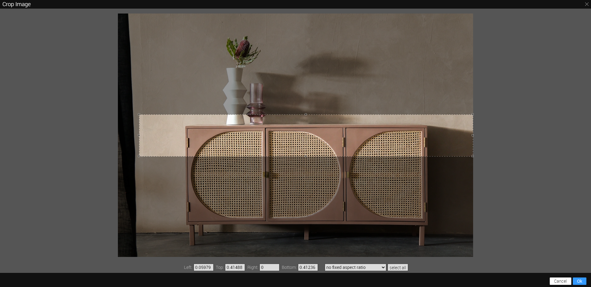
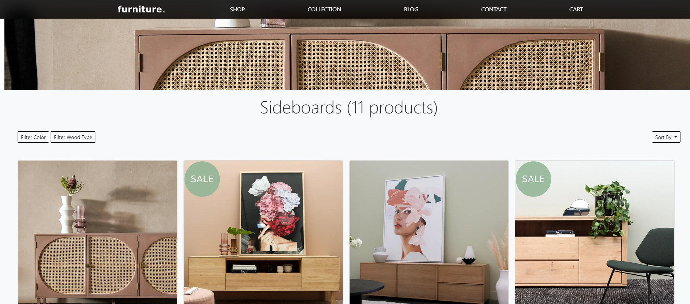
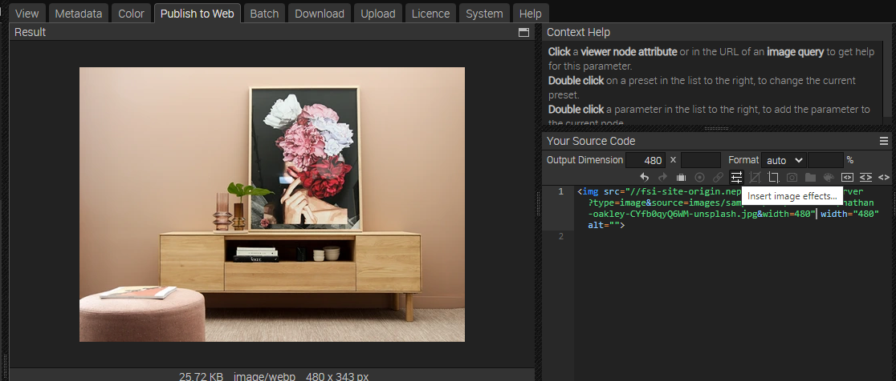
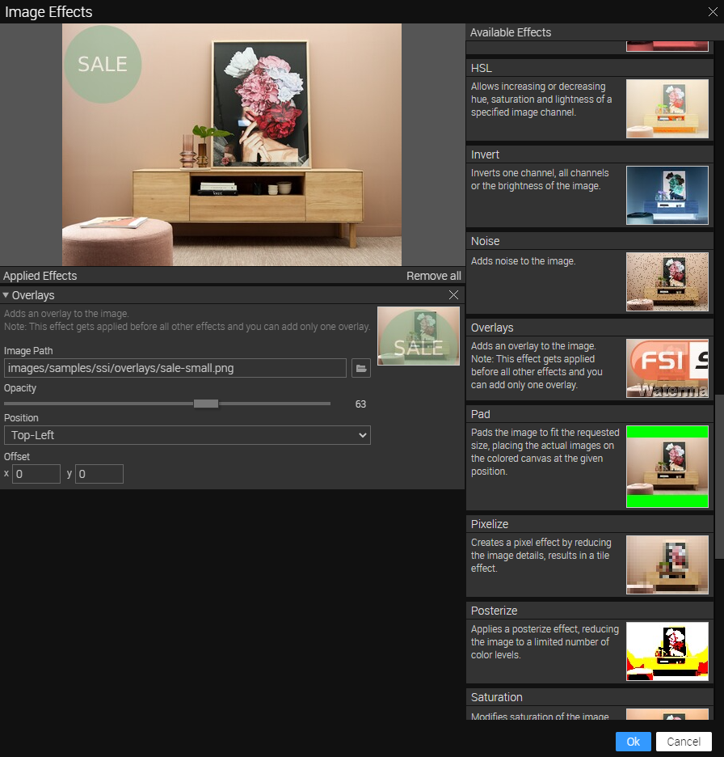

# Product Listing Page - Embedding images using Single Source Imaging

This readme describes how the product listing page sample with *Single Source Imaging* of *FSI Server* is achieved.
The aim of the demo is to show how you can easily integrate different sizes and formats of an image by simply changing the Image URL.
It also shows how static assets saved on FSI Server can be embedded.

# Use images on the website

While having an image or folder selected, you can see all possible publishing ways for the specific item by visting the Publish To Web tab.
For this example, select the preset *Simple Image*:



Simple Image publishes the image with a simple  tag. Requires a single high resolution image. You can set the output dimensions and format (auto automatically chooses the best format for the browser used, or you can set WEBP, JPEG, PNG or GIF) as well as add various effects to the static image.


The *Source Code* section enables you to control the look of your image or viewer by setting the dimensions and format, as well as adding effects or crop options to it.
In this area you also can see the source code for your selected publishing option which you can edit and copy to publish the images.

You can then add the images to your site via image tag:

```html
 
```
You can change the width and/or height directly in the image tag, the image will scale accordingly.

# Adding a crop effect

As you can see in the last image tag above, a crop effect was used.

You can do this easily in the *Publish To Web* tab. While having selected *Simple Image* as preset,
choose the crop icon in the Source Code toolbar.



In the modal, you can add the crop area to the image via drag & drop.
Select OK as soon as you are finished.



The URL created will look like this:


[https://docs.neptunelabs.com/fsi/server?type=image&source=images/samples/ssi/furniture/nathan-oakley-2zlZGqqmVGE-unsplash.jpg&width=1879&rect=0,0.41576,1,0.17255](https://docs.neptunelabs.comp/fsi/server?type=image&source=images/samples/ssi/furniture/nathan-oakley-2zlZGqqmVGE-unsplash.jpg&width=1879&rect=0,0.41576,1,0.17255)

The *&rect=* part defines the area of the cropping.

# Adding overlays (Sale icon)

It's also possible to add overlays to your images, such as the sales icon which is placed
over some of the images in the *listing section* section.



You can do this easily in the *Publish To Web* tab. While having selected *Simple Image* as preset,
choose the effects icon in the Source Code toolbar.



In the modal, add the *Overlays* effect to the image via drag & drop.
Choose the image path where your overlay is stored on FSI Server. You can then change the opacity, position and offset and
see the changes directly in the preview window.
Select OK as soon as you are finished.



The URL created will look like this:


[https://docs.neptunelabs.com/fsi/server?type=image&source=images/samples/ssi/furniture/nathan-oakley-CYfb0qyQ6WM-unsplash.jpg&width=480&renderer=overlay&overlays=images/samples/ssi/overlays/sale-small.png(63,TL,0,0](https://docs.neptunelabs.com/fsi/server?type=image&source=images/samples/ssi/furniture/nathan-oakley-CYfb0qyQ6WM-unsplash.jpg&width=480&renderer=overlay&overlays=images/samples/ssi/overlays/sale-small.png(63,TL,0,0))


## Testing with examples from  your own server

To test the examples with images from your own [FSI Server](https://www.neptunelabs.com/fsi-server/), please first copy the env.yml.dist file to env.yml and adapt the file, then restart the main demo again.
