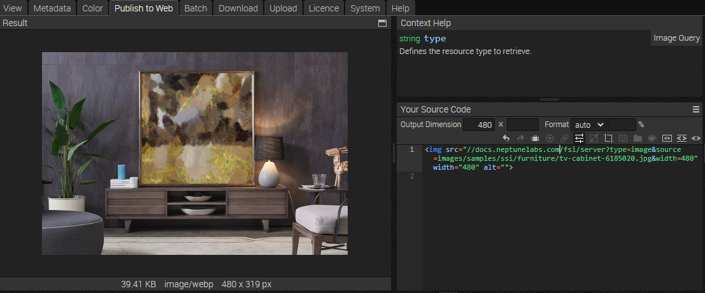
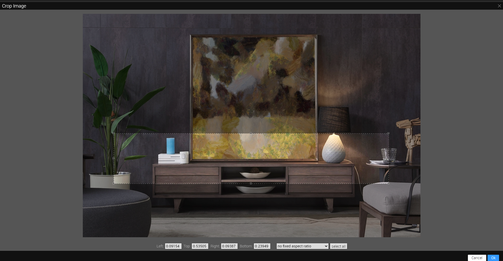

# Product Listing Page - Embedding images using Single Source Imaging

This readme describes how the product listing page sample with *Single Source Imaging* of *FSI Server* is achieved.
The aim of the demo is to show how you can easily integrate different sizes and formats of an image by simply changing the Image URL.
It also shows how static assets saved on FSI Server can be embedded.

# Adding a crop effect

As you can see in the last image tag above, a crop effect was used.

You can do this easily in the *Publish To Web* tab. While having selected *Simple Image* as preset,
choose the crop icon in the Source Code toolbar.

In the modal, you can add the crop area to the image via drag & drop.
Select OK as soon as you are finished.

The URL created will look like this:

[https://docs.neptunelabs.com/fsi/server?type=image&source=images/samples/ssi/furniture/nathan-oakley-o4s4AfTgOvg-unsplash.jpg&width=480&rect=0.15187,0,0.84813,1](https://docs.neptunelabs.comp/fsi/server?type=image&source=images/samples/ssi/furniture/nathan-oakley-o4s4AfTgOvg-unsplash.jpg&width=480&rect=0.15187,0,0.84813,1)

The *&rect=* part defines the area of the cropping.

## Testing with examples from  your own server

To test the examples with images from your own [FSI Server](https://www.neptunelabs.com/fsi-server/), please first copy the env.yml.dist file to env.yml and adapt the file, then restart the main demo again.
